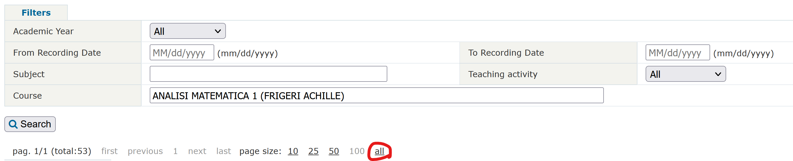

# Polimi recordings downloader
This Python application is used to download a batch of lessons recordings of Politecnico di Milano.

This app is intended to download a large amount of recordings (i.e. entire courses) in an easy and fast way.
If you want to download a single recoring consider using [this browser extension](https://github.com/jacopo-j/WebXDownloader).

## Table of content
- [Polimi recordings downloader](#polimi-recordings-downloader)
  - [Table of content](#table-of-content)
  - [Set up](#set-up)
    - [System dependencies](#system-dependencies)
    - [Python dependencies](#python-dependencies)
  - [Usage](#usage)
    - [GUIDE 1: Download from recording archives](#guide-1-download-from-recording-archives)
    - [GUIDE 2: Download from a list of Webex urls or video ids](#guide-2-download-from-a-list-of-webex-urls-or-video-ids)
    - [GUIDE 3: Download from Webeep "Recordings" page](#guide-3-download-from-webeep-recordings-page)
    - [GUIDE 4: Download from webpage url](#guide-4-download-from-webpage-url)
    - [GUIDE 5: Download from webpage HTML](#guide-5-download-from-webpage-html)
    - [Output](#output)
    - [Tips](#tips)
      - [Retrying downloads without reparsing, directly from dowaload_links.txt](#retrying-downloads-without-reparsing-directly-from-dowaload_linkstxt)

## Set up
### System dependencies
- [Python](https://www.python.org/downloads/)
- [aria2](https://github.com/aria2/aria2/releases/): this needs to be in your $PATH (for example, put aria2c.exe inside C:\Program Files\aria2c and add this filder to $PATH)

### Python dependencies
- **(Optional) Create a virtual environment**: inside the project folder use `python -m venv .venv`. Activate the environment using `.venv\Scripts\activate.bat` on Windows or `source .venv/bin/activate` on Unix/MacOS. See [here](https://docs.python.org/3/tutorial/venv.html) for more informations about virtual envirorments. If you know how to use [Poetry](https://python-poetry.org/) you could use that instead.
- **Install libraries**: `pip install -r requirements.txt`

## Usage
Run `python -m prd --help` for information about usage and additional options.

This app can download the recordings from:
1. An URL to the recordings archives where there are all the links to the recordigs you want to download
2. A txt file with the links to the recordings
3. An URL to a Webeep "Recordings" page where the professor links the recordings.
4. The URL to a public (no authentication) webpage where the professor links directly the links to the videos (for example, the personal site of the professor)
5. An HTML file with the direct links to the videos. This is useful when the webpage is behind authentication.

### GUIDE 1: Download from recording archives
This mode parses a page from the recordings archives to fetch the download links of the videos.

In order to download a batch of recordings some steps are required:
1. With your browser [open the recordings archives](https://servizionline.polimi.it/portaleservizi/portaleservizi/controller/preferiti/Preferiti.do?evn_srv=evento&idServizio=2314). From the browser copy the `SSL_JSESSIONID` cookie value and set it using: `python -m prd set-cookie SSL_JSESSIONID "{COOKIE_VALUE}"`.
2. With your browser [open Webex](https://politecnicomilano.webex.com/webappng/sites/politecnicomilano/dashboard?siteurl=politecnicomilano) and login. From the browser copy the `ticket` cookie value and set it using: `python -m prd set-cookie ticket "{COOKIE_VALUE}"`.
3. With your browser navigare to the [recordings archive](https://servizionline.polimi.it/portaleservizi/portaleservizi/controller/preferiti/Preferiti.do?evn_srv=evento&idServizio=2314) and search for a course to download. Try to have all the recordings in a single page.
4. Make sure to have all the recordings you want in the page

5. Copy the current URL and run: `python -m prd archives "{URL}"`

### GUIDE 2: Download from a list of Webex urls or video ids
This mode parses an TXT file with the urls or video ids of some recordings in the format:
- `{VIDEO_ID}`
- `https://politecnicomilano.webex.com/politecnicomilano/ldr.php?RCID={VIDEO_ID}`
- `https://politecnicomilano.webex.com/recordingservice/sites/politecnicomilano/recording/playback/{VIDEO_ID}`
- `https://politecnicomilano.webex.com/recordingservice/sites/politecnicomilano/recording/{VIDEO_ID}/playback`
- `https://politecnicomilano.webex.com/webappng/sites/politecnicomilano/recording/{VIDEO_ID}/playback`
- `https://politecnicomilano.webex.com/webappng/sites/politecnicomilano/recording/playback/{VIDEO_ID}`
- `https://politecnicomilano.webex.com/webappng/sites/politecnicomilano/recording/{VIDEO_ID}`

This command supports only downloading one course at the time.

Some steps are required:
1. With your browser [open Webex](https://politecnicomilano.webex.com/webappng/sites/politecnicomilano/dashboard?siteurl=politecnicomilano) and login. From the browser copy the `ticket` cookie value and set it using: `python -m prd set-cookie ticket "{COOKIE_VALUE}"`.
2. Run `python -m prd txt --course="My beutiful course" --academic-year="2021-22" {TXT_FILE}`.

### GUIDE 3: Download from Webeep "Recordings" page
This mode parses a "Recordings" page where the professor links the recordings.

Some steps are required:
1. With your browser [open Webeep](https://webeep.polimi.it). From the browser copy the `MoodleSession` cookie value and set it using: `python -m prd set-cookie MoodleSession "{COOKIE_VALUE}"`.
2. With your browser [open Webex](https://politecnicomilano.webex.com/webappng/sites/politecnicomilano/dashboard?siteurl=politecnicomilano) and login. From the browser copy the `ticket` cookie value and set it using: `python -m prd set-cookie ticket "{COOKIE_VALUE}"`.
3. With your browser navigare to the Webeep recordings section and copy the url of the page.
4. Run `python -m prd webeep --academic-year="2021-22" {WEBEEP_URL}`.

### GUIDE 4: Download from webpage url
This mode parses an URL to a public (i.e. without authentication) HTML page where the professor links directly the recordings.

Some steps are required:
1. With your browser [open Webex](https://politecnicomilano.webex.com/webappng/sites/politecnicomilano/dashboard?siteurl=politecnicomilano) and login. From the browser copy the `ticket` cookie value and set it using: `python -m prd set-cookie ticket "{COOKIE_VALUE}"`.
2. With your browser navigate to the page where the direct links are placed.
3. Copy the URL of the page.
4. Run `python -m prd webpage-url --course="{COURSE_NAME}" --academic-year="2021-22" {URL}`.

### GUIDE 5: Download from webpage HTML
This mode parses an HTML file where the professor linked directly the recordings.

Some steps are required:
1. With your browser [open Webex](https://politecnicomilano.webex.com/webappng/sites/politecnicomilano/dashboard?siteurl=politecnicomilano) and login. From the browser copy the `ticket` cookie value and set it using: `python -m prd set-cookie ticket "{COOKIE_VALUE}"`.
2. With your browser navigate to the page where the direct links are placed.
3. Download the page HTML.
4. Run `python -m prd webpage-html --course="{COURSE_NAME}" --academic-year="2021-22" {FILE_PATH}`.

### Output
Inside the output folder there will be:
- A `dowaload_links.txt` file which is the one fed to `aria2`. If the option `--no-aria2c` is used this file will contain a list of download links to be passed to another program (for example, [Free Download Manager](https://www.freedownloadmanager.org/)) to download the recordings.
- One folder for each course parsed. Inside this folder there will be the recordings and an `xlsx` file with the recordings metadata (unless `--no-create-xlsx` is used).

### Tips
#### Retrying downloads without reparsing, directly from dowaload_links.txt
Use the command `aria2c --input-file=output/dowaload_links.txt --auto-file-renaming=false --dir=output --max-concurrent-downloads=16 --max-connection-per-server=16`.
